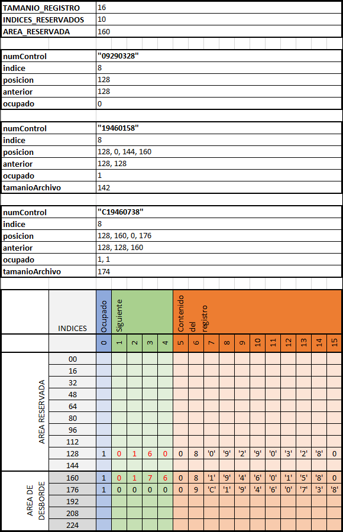

Archivo Directo en Java
==========================

Los archivos directos, también conocidos como de acceso aleatorio, permiten
acceder a los datos contenidos especificando la posici´n donde ser´n le´dos o
escritos.

Dada la versalitidad del acceso aleatorio en los archivos, existen diversas
técnicas para el almacenamiento de datos. De manera general se depende de que
cada uno de los registros cuente con un **campo clave**, el cual se utiliza para
determinar la posición del registro dentro del archivo.

Algoritmo
--------------------------

A continuación, se presenta un algoritmo para el almacenamiento de registros, en
donde el *campo clave* es el **número de control** y se utiliza como índice de
posición el último dígito del mismo.

Se incluye un ejemplo gráfico con la captura de los números de control:
`"09290328"`, `"19460158"` y `"C19460738"`. Todos terminan con el número `8`
para que coincidan en con el mismo índice.



### Pseudocódigo

```java
// DEFINIR CONSTANTES
TAMANIO_REGISTRO     = 16
INDICES_RESERVADOS   = 10
AREA_RESERVADA       = INDICES_RESERVADOS * TAMANIO_REGISTRO

IMPRIMIR "Introducir Número de Control: "
numControl = Teclado.leer()


archivo = ArchivoAleatorio.abrir("MiArchivo.bin")

// CALCULAR POSICIÓN DE REGISTRO
indice = numControl.ultimoDigito()
posicion = indice * tamañoRegistro
anterior = posicion

archivo.setPosicion(posicion)

ocupado = archivo.leerByte()

MIENTRAS ocupado = 1 ENTONCES

    anterior = posicion
    posicion = archivo.leerInt() // 4 bytes

    SI posicion = 0 ENTONCES

        // Colocar después del último registro en el archivo
        tamanioArchivo = archivo.length()
        posicion = RedondeoArriba(tamanioArchivo / TAMANIO_REGISTRO) * TAMANIO_REGISTRO

        // Si la posición está dentro del área reservada
        SI posicion < AREA_RESERVADA ENTONCES
            posicion = AREA_RESERVADA
        FIN_SI

        SALIR_MIENTRAS

    FIN_SI

    archivo.setPosicion(posicion)
    ocupado = archivo.leerByte()

FIN_MIENTRAS


// ESCRIBIR CONTENIDO DEL REGISTRO
// Indicar que registro esta ocupado
archivo.escribirByte(1)

// Desplazar contenido 4 bytes (1 int) m´s para la posici´n
archivo.seek(archivo.getPosicion() + 4)

// Escribir datos del registro
registro.escribir(archivo)


// COLOCAR PUNTERO DEL NUEVO REGISTRO EN EL ANTERIOR
SI anterior != posicion ENTONCES
    archivo.setPosicion(anterior + 1)   // se incrementa 1 por el byte de ocupado
    archivo.escribirInt(posicion)
FIN_SI

archivo.cerrar()
```